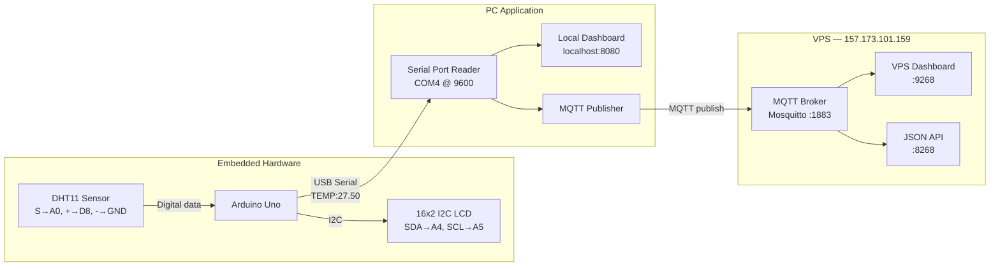
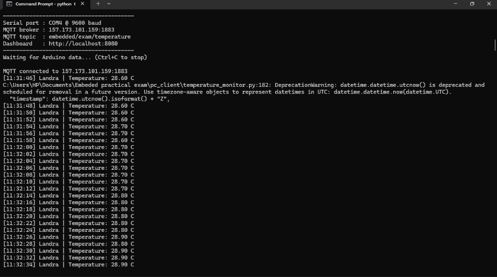

# Embeded_Exam — Embedded Practical Exam Project

Temperature monitoring system: **DHT11 Sensor → Arduino Uno → LCD → USB Serial → PC Program → MQTT Broker → VPS Dashboard**

## System Architecture

### Block Diagram



### Data Flow

1. **DHT11 → Arduino**: The sensor sends digital temperature data on pin **A0** (power from **D8**, ground on **GND**).
2. **Arduino → LCD**: Row 1 shows the candidate name (scrolls if longer than 16 characters). Row 2 shows `Temp: XX.X C`.
3. **Arduino → PC**: Temperature is sent over USB serial every 2 seconds as `TEMP:<value>`.
4. **PC → Local display**: The PC client shows readings in the terminal and on **http://localhost:8080**.
5. **PC → MQTT**: Each reading is published to the VPS Mosquitto broker on port **1883**.
6. **MQTT → VPS Dashboard**: The VPS app subscribes to the topic and displays live data on **http://157.173.101.159:9268**.

### Hardware Connections

#### DHT11 Temperature Sensor (S, +, -)

| Sensor pin | Arduino Uno |
|------------|-------------|
| **S** (signal) | **A0** |
| **+** (power) | **D8** (configured as 5V output) |
| **-** (ground) | **GND** |

#### 16×2 LCD — I2C (4 wires)

| LCD wire | Arduino Uno |
|----------|-------------|
| **VCC** | **5V** |
| **GND** | **GND** |
| **SDA** | **A4** |
| **SCL** | **A5** |

### System Flow (ASCII)

```
[DHT11] ──► [Arduino Uno] ──► [16x2 LCD]
                │
                └── USB Serial (9600 baud)
                        │
                        ▼
              [PC: temperature_monitor.py]
                   │            │
                   ▼            ▼
         [localhost:8080]   [MQTT :1883]
                                │
                                ▼
                    [VPS Dashboard :9268]
```

More details: [docs/architecture.md](docs/architecture.md)

## Candidate Tasks Completed

| Task | Location |
|------|----------|
| **(a) System architecture diagram** | See [System Architecture](#system-architecture) above and [docs/architecture.md](docs/architecture.md) |
| **(b) Arduino program** | [arduino/temperature_lcd_serial/temperature_lcd_serial.ino](arduino/temperature_lcd_serial/temperature_lcd_serial.ino) |
| **(c) Horizontal name scrolling** | Implemented in Arduino sketch (`showNameRow()`) |
| **(d) PC client (serial + MQTT + display)** | [pc_client/temperature_monitor.py](pc_client/temperature_monitor.py) |
| **(e) Communication names** | See table below |

## Communication Names

### Serial (Arduino ↔ PC)

| Setting | Value |
|---------|-------|
| Baud rate | `9600` |
| Data format | `TEMP:<temperature>` per line |
| Example | `TEMP:24.50` |
| PC port (Windows) | `COM3` (change in `config.env`) |

### MQTT (PC → VPS Broker)

| Setting | Value |
|---------|-------|
| Broker | `157.173.101.159` |
| Port | `1883` |
| Topic | `embedded/exam/temperature` |
| Username | `user268` |
| Payload | `{"candidate":"Landra","temperature":27.5,"unit":"C","timestamp":"..."}` |
| VPS Dashboard | `http://157.173.101.159:9268` |
| VPS API | `http://157.173.101.159:8268/api/latest` |

## Quick Start

### 1. Arduino

1. Install **LiquidCrystal I2C** and **DHT sensor library** in Arduino IDE.
2. Open `arduino/temperature_lcd_serial/temperature_lcd_serial.ino`.
3. Set your name in `CANDIDATE_NAME` (use more than 16 characters to test scrolling).
4. Wire the **DHT11** and **I2C LCD** as shown in [System Architecture](#system-architecture).
5. Upload to Arduino Uno.

### 2. PC Client

```powershell
cd pc_client
python -m venv venv
.\venv\Scripts\Activate.ps1
pip install -r requirements.txt
copy config.env.example config.env
# Edit config.env: SERIAL_PORT, MQTT_BROKER, CANDIDATE_NAME
python temperature_monitor.py
```

### 3. Expected Output (PC)

```
[11:31:46] Landra | Temperature: 28.60 C
[11:31:48] Landra | Temperature: 28.70 C
[11:31:50] Landra | Temperature: 28.80 C
```

PC client running with MQTT connected to the VPS broker:



- **Local dashboard:** http://localhost:8080  
- **VPS dashboard:** http://157.173.101.159:9268

## LCD Behavior

- **Row 1**: Candidate name. If the name is **16 characters or fewer**, it is shown statically. If **longer than 16 characters**, it scrolls horizontally.
- **Row 2**: `Temp: XX.X C`

## Project Structure

```
Embeded practical exam/
├── README.md
├── docs/
│   └── architecture.md
├── arduino/
│   └── temperature_lcd_serial/
│       └── temperature_lcd_serial.ino
├── pc_client/
│   ├── config.env.example
│   ├── dashboard.html
│   ├── requirements.txt
│   └── temperature_monitor.py
└── vps/
    └── exam/
        ├── app.py
        ├── dashboard.html
        └── start.sh
```
