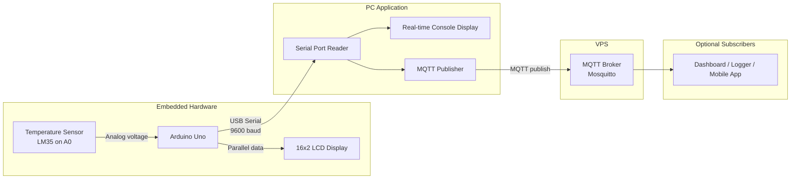

# System Architecture

## Block Diagram

## Data Flow

1. **Sensor → Arduino**: LM35 outputs 10 mV per °C; Arduino reads analog pin A0 and converts to Celsius.
2. **Arduino → LCD**: Row 0 shows the candidate name (scrolls if longer than 16 characters). Row 1 shows the temperature.
3. **Arduino → PC**: Temperature is sent over USB serial using a fixed text format.
4. **PC → MQTT**: The PC client parses each reading and publishes it to the broker on the VPS.
5. **PC display**: The same client prints each received value in the terminal in real time.

## Communication Names

| Link | Name / Setting | Value |
|------|----------------|-------|
| Serial port (Arduino ↔ PC) | **Baud rate** | `9600` |
| Serial port (Arduino ↔ PC) | **Line format** | `TEMP:<value>\n` (example: `TEMP:24.50`) |
| Serial port (Arduino ↔ PC) | **PC port name** | `COM3` on Windows (adjust per machine) |
| MQTT | **Topic** | `embedded/exam/temperature` |
| MQTT | **Payload** | JSON: `{"candidate":"...","temperature":24.5,"unit":"C"}` |
| MQTT | **Broker** | Configure in `pc_client/config.env` (VPS IP/hostname + port) |

## Hardware Connections (Arduino Uno)

### LM35 Temperature Sensor
| LM35 | Arduino Uno |
|------|-------------|
| VCC  | 5V          |
| GND  | GND         |
| OUT  | A0          |

### 16×2 LCD (4-bit mode)
| LCD | Arduino Uno |
|-----|-------------|
| RS  | 12          |
| EN  | 11          |
| D4  | 5           |
| D5  | 4           |
| D6  | 3           |
| D7  | 2           |
| VSS | GND         |
| VDD | 5V          |
| V0  | 10k pot (contrast) |
| A/K | Backlight (as per module) |
